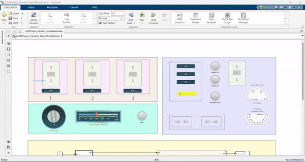
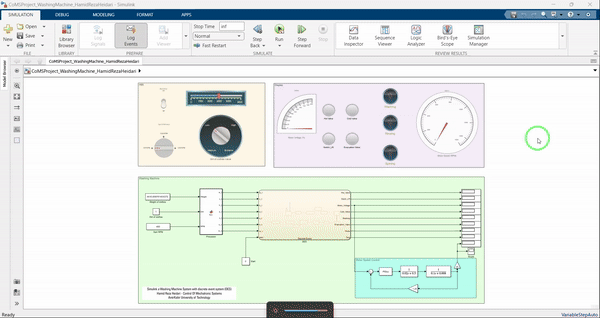

## 🎯 Discrete Envent System (DES) Model 

The objective of this project is to model and simulate discrete event systems (DES) to analyze their performance and control logic under event-driven behavior.
In a DES, system states change only at discrete points in time, triggered by specific events such as arrivals, departures, or state transitions.
We implemented and compared two DES-based systems — a washing machine and a three-floor elevator — to study event scheduling, queue management, and resource allocation in MATLAB.

## ⚙️ System Models

1️⃣ Washing Machine System

The washing machine model represents a cyclic process with sequential states: Filling → Washing → Rinsing → Spinning → Idle.
Each state transition is triggered by a discrete event (e.g., timer completion or water level reached).
The simulation ensures that processes do not overlap, maintaining synchronization between washing cycles and idle times.

2️⃣ Three-Floor Elevator System

The elevator system is modeled as an event-driven transportation system where requests, door actions, and movements between floors are all events.
It handles multiple requests using a queue-based logic, prioritizing floors based on request order and current direction.
The system is designed to minimize waiting time and idle travel while ensuring safety constraints.

## 📊 Results

Simulation outcomes revealed that:
The washing machine DES successfully followed the designed event sequence and timing, proving effective for modeling cyclic processes.
The elevator DES handled random passenger requests efficiently, demonstrating event-based scheduling and queue optimization capabilities.
Both systems validated the power of DES modeling in capturing real-world discrete, asynchronous behaviors.
 
## 🧠 Tools & Environment   
-Software: MATLAB / SimEvents / Simulink    
-Systems: Washing Machine and 3-Floor Elevator   
-Approach: Event scheduling, state transition logic, and queue-based resource control    

  
   
  

